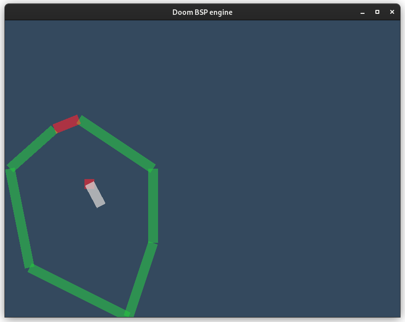

# Rust Doom BSP engine

A Doom-like BSP engine written in Rust. Features drawing a minimap.
24.4.2022 map traversing through portals

23.4.2022 first person view and transformed minimap view

20.4.2022 portals are drawn

19.4.2022 map walls are drawn


## How To Build It ?

Download Rust compiler from [here](https://www.rust-lang.org/en-US/), change the working directory to the root of this project, then execute the following command:

```
> cargo build
```

The executable binary will appear in `target/debug`, called `rust-doom-bsp-engine`.

## Controls

- arrow keys

## TODOs

- draw first person point of view :heavy_check_mark:
- draw segments after portals

## Bugs

- Yes.
